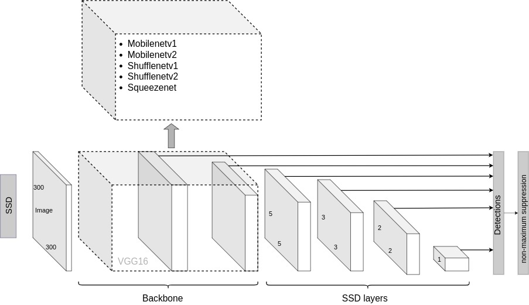
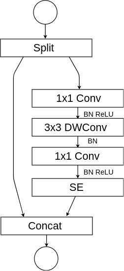

## SSD: Single-Shot MultiBox Detector implementation in Keras for pedestrian detection
---
### Contents

1. [Overview](#overview)
2. [Performance](#performance)
3. [Pascal VOC](#pascal)
4. [Dependencies](#dependencies)
5. [Weights](#weights)

### Overview

This is a Keras port of the SSD model architecture introduced by Wei Liu et al. in the paper [SSD: Single Shot MultiBox Detector](https://arxiv.org/abs/1512.02325).

This repository provides an extension from [https://github.com/pierluigiferrari/ssd_keras](https://github.com/pierluigiferrari/ssd_keras) adding new backbones and a new network architecture for detection. All architectures were trained for pedestrian detection using PASCAL VOC 2007 and 2012.
Currently, this implementation contains the following feature extractors:
- [Mobilenetv1](https://arxiv.org/abs/1704.04861)
- [Mobilenetv2](https://arxiv.org/abs/1801.04381)
- [Shufflenetv1](https://arxiv.org/abs/1707.01083)
- [Shufflenetv2](https://arxiv.org/abs/1807.11164)
- [Squeezenet](https://arxiv.org/abs/1602.07360)

SSD/NoShuffleSE uses a reduced version of the Shufflenetv2 architecture as a backbone and replaces the standard ssd layer for Shufflenetv2 blocks. SSD/NoShuffleSE integrates Squeeze and Excitations units and removes the shuffle operations.

### Performance
| Architectura      | Training set | F1 score | FPS |
|-------------------|--------------|----------|-----|
| SSD/Mobilenetv1   | 07++12       | 0.6501   | **22**  |
| SSD/Mobilenetv2   | 07++12       | 0.6094   | 12  |
| SSD/Shufflenetv1  | 07++12       | 0.6121   | 12  |
| SSD/Shufflenetv2  | 07++12       | 0.6743   | 14  |
| SSD/Squeezenet SB | 07++12       | 0.5722   | 35  |
| SSD/NoShuffleSE   | 07++12       | 0.6768   | 20  |
| SSD/NoShuffleSE   | 07++12+COCO  | **0.7094**   | 20  |

SB indicates simple bypass.
The time is measured with Intel® Core™ i7-7740X CPU @ 4.30GHz × 8, Frames per second (FPS).
SSD/NoShuffleSE achieves an Average Precision of **66.0** on PASCAL VOC 2007.

### PASCAL 
You can download the PASCAL dataset in the format needed for the model in [download_pascal_dataset.ipynb](download_pascal_dataset.ipynb)

### Dependencies

* Python 3.x
* Numpy
* TensorFlow 1.x
* Keras 2.x
* OpenCV
* Beautiful Soup 4.x

### Weights